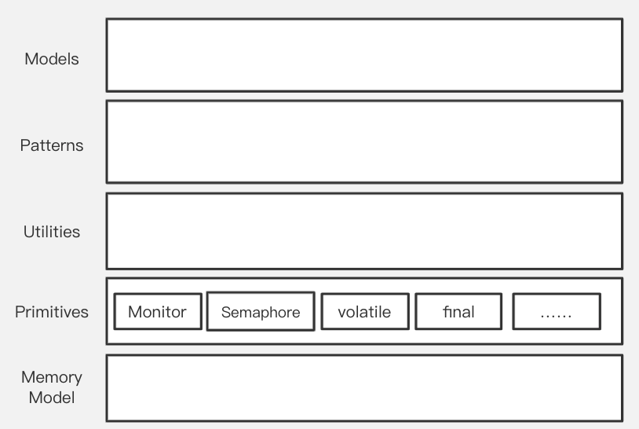
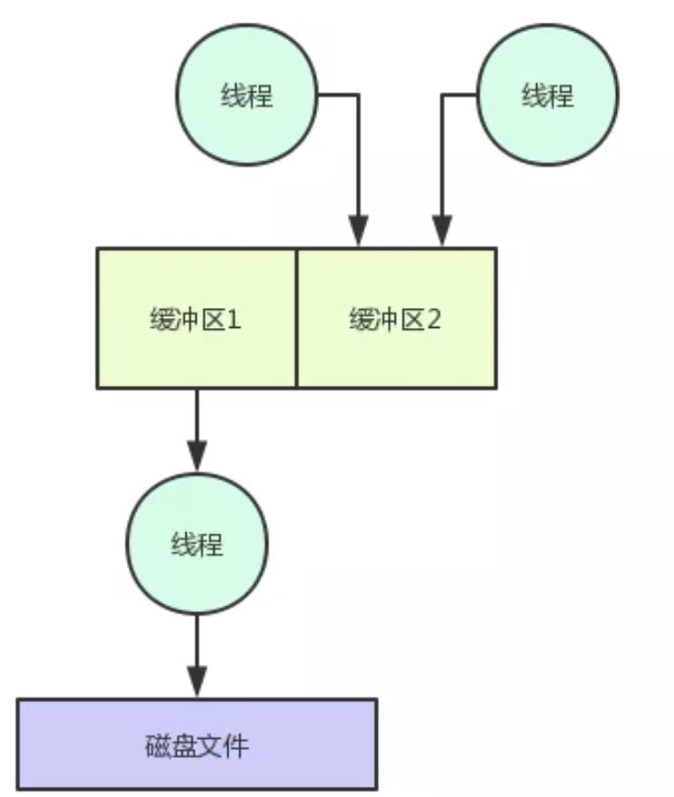

# concurrent_challenges
From an abstract view,the concurrent programming tech stack is a stack of building blocks: higher level blocks are built upon lower level blocks and try to make it easier for programmers to use.



For most programmers,learning concurrent programming is about learning how to use these building blocks(or tools). Reading books is far not enough,you have to practice.

This repo lists some interesting and challenging puzzles about concurrent programming, and I try to group them into different categories.

**Can you solve them on yourself?**

(Since below are copied from my note, part of them are written in chinese)
# 并发编程挑战:你能解决这些问题吗？

## 1. Primitives

### 1.1. 多线程同步

- [x] [多线程循环打印](https://juejin.im/post/5c89b9515188257e5b2befdd)

我写了篇[解题笔记](https://www.jianshu.com/p/1978e0d07bc7)


- [x] [leetcode上的并发编程题](https://leetcode-cn.com/problemset/concurrency/)

### 1.2. Semaphore
- [x] 用go语言实现Semaphore

go标准库里没有Semaphore,可以自己写一个

提示：用channel
  
- [ ] 用信号量实现生产消费模式  
### 1.3. Monitor & Lock

- [x] 用信号量实现锁

- [ ] 用信号量实现Monitor模型
 
- [x] 实现一个读写锁

我写了[题解](https://www.jianshu.com/p/4c3be783884f)


- [ ] 用信号量实现读写锁

  - [ ] 读优先

  - [ ] 写优先
  
Tips: 看看操作系统课程里怎么说

- [x] 实现不可重入锁。

参考：[网上的实现](https://kanonjz.github.io/2017/12/27/reentrantlock-and-spinlock/)允许没持有锁的线程unlock，不安全。请实现一个安全的不可重入锁

- [ ] 实现公平/非公平锁

- [ ] 实现公平/非公平的读写锁


## 2. Utilities
### 2.1. Concurrent Data Structures

#### 2.1.1. Cache
- [ ] 用golang实现一个`<key,value>`缓存数据结构，本质上是并发安全的Map，但是要求有缓存加载锁(类似于java中的Guava库)

- [ ] 优化：保证没有OOM或者频繁GC问题

java可以选择：

a.申请堆外内存

b.使用弱引用

但是golang呢？

- [ ] 实现一个支持配ttl的cache

#### 2.1.2. Double Buffering
Double buffering技术适用场景：
- 在IO操作多的时候做优化，分离计算线程和IO线程、让计算和IO并行。具体来说，让主线程基于主Buffer做内存计算，第二线程基于副Buffer做IO操作。当主Buffer完成计算后，swap这两个buffer。
详见https://www.youtube.com/watch?v=qdeBmEnv_bI
或者
https://mp.weixin.qq.com/s/d4qfu2MxESc1YJV4Ud5mnA



- 事务提交，写完整块buffer后通过swap实现commit，避免脏读。计算机渲染图像时候用到的Double Buffer就是这种思想，见https://www.youtube.com/watch?v=7cRRxlWRl8g
和 https://www.youtube.com/watch?v=f3tO_gyyLmk

现在，我们的挑战是：
- [ ] 实现一个通用的Double Buffer数据结构，预留钩子进行扩展

#### 2.1.3. Queue

##### 阻塞队列

- [x] Implement a blocking queue based on array

- [ ] 挑战0.Implement a blocking queue based on linkedlist

参考[two lock queue算法](http://www.cs.rochester.edu/research/synchronization/pseudocode/queues.html)

- [ ] 挑战0.1.Implement a **lock-free** blocking queue based on linkedlist

同样参考上述论文

参考<Java concurrency in practice>无锁算法章节

- [x] 挑战1.搞明白[jdk咋做的](https://blog.csdn.net/USTC_Zn/article/details/54864244)

ArrayBlockingQueue的put和take公用同一把锁。

（理论上，ArrayBlockingQueue也可优化成用cas做无锁put、take）

LinkedBlockingQueue的put和take用不同的锁。可以想想，为什么这两个操作可以用不同的锁？

- [ ] 挑战2.0. 使用Disruptor写[生产消费模式题目](https://www.wandouip.com/t5i116221/)

- [x] 挑战2.1. 搞明白[Disruptor](https://coolshell.cn/articles/9169.html)咋做的

https://www.jianshu.com/p/1bf7a4c34cf3

- [ ] 挑战3.模拟一个Disruptor

- [ ] 挑战4.阅读lock-free、nonblocking algorithms相关资料

##### DelayQueue

- [ ] 用Golang实现一个DelayQueue
  
- [x] (java)使用DelayQueue实现一个超时自动删key的cache

参考https://www.cnblogs.com/fengjian/p/5169003.html

- [x] 挑战1.理解DelayQueue内部原理

- [x] 挑战2.0. 实现一个DelayQueue

- [x] 挑战2.1. 优化实现的DelayQueue，解决惊群问题

- [x] 挑战3.对比其他Timer algorithm，比如时间轮

https://juejin.im/entry/5bd975a1e51d453189120305

http://russellluo.com/2018/10/golang-implementation-of-hierarchical-timing-wheels.html

如果任务全塞delay queue太慢了，所以插入槽；如果全用秒级槽，时间跨度长太多了，所以用层级槽


- [x] 挑战4.实现简单Time Wheel

我尝试写了下，corner case处理起来太恶心了

- [ ] 挑战5.实现层级Time Wheel

- [ ] 挑战6.外存/分布式系统场景，怎么做容错的延时任务？

https://juejin.im/post/5b5e52ecf265da0f716c3203#heading-4

https://juejin.im/post/5b679f8ae51d4513ee6e0e97

https://juejin.im/post/5d2d3d39e51d45775c73dd8b

- [x] 挑战7.理解crontab原理

  - cronb表达式解析、求next()的算法
  
  https://blog.csdn.net/u014798316/article/details/46460697
  
  https://blog.csdn.net/ukulelepku/article/details/54310035
  
  https://stackoverflow.com/questions/321494/calculate-when-a-cron-job-will-be-executed-then-next-time
  
  - crontab定时任务原理
  
  https://cloud.tencent.com/developer/article/1183262
  
  https://www.quora.com/How-does-cron-work

  https://blog.csdn.net/coder_xia/article/details/60871082

- [ ] 挑战8.设计分布式crontab

https://landing.google.com/sre/sre-book/chapters/distributed-periodic-scheduling/

- [ ] 假如某个RPC调用失败了，我们想每隔2秒重试一次，请基于Timer(延迟队列/时间轮）实现定时重试功能

参考：
https://www.javadoop.com/post/HashedWheelTimer

- [ ] 挑战：支持多种重试策略，比如指数退避

参考：
https://cloud.google.com/storage/docs/exponential-backoff?hl=zh-cn

- [ ] 挑战2：讲讲TCP中的指数退避拿来干嘛的，指数退避 和 AIMD 啥关系?


##### non-blocking queue

- [ ] 实现lock-free queue

https://www.coursera.org/learn/concurrent-programming-in-java/lecture/B2lJf/4-2-concurrent-queue

[lock free data structures](https://www.youtube.com/watch?v=DdAV7891-OA&list=PLVe-2wcL84b9G9o7KPubp6NO0nqI1a-Qp&index=5)

#### 2.1.4. BitSet  
- [ ] 实现一个并发安全的bitset
  
### 2.2. Utils
#### 2.2.0. once.Do
- [ ] 在其他语言中实现 golang的`once.Do`工具

#### 2.2.1. Thread Pool

- [ ] 实现一个线程池

- [ ] 实现CompletionService

- [x] 向线程池Executor提交一组任务、返回很多future时，不好批量设置超时时间(比如“500ms内执行完所有任务，否则全体取消”）。实现一个工具类，包含方法get(List<Future<T>> futures,long timeout, TimeUnit unit), 以便批量设置超时时间

  注：注意到ExecutorService.invokeAll(Collection<? extends Callable<T>> tasks,
                                     long timeout, TimeUnit unit)
     该方法能够实现批量超时，但实践中有时候不同的future来自于不同的地方，因此还是需要一个支持让future批量超时的get方法

参考https://github.com/seeflood/Advanced-Concurrent/blob/master/src/main/java/io/github/seeflood/advanced/concurrent/FutureUtils.java  

- [ ] 封装一个能防饥饿、自动限流的线程池ExecutorService

- [ ] 自适应调参的线程池

- [x] 假如任务之间存在先后顺序的依赖关系，那么所有任务可以抽象为一个DAG。实现一个能够执行DAG任务的线程池

参考https://github.com/seeflood/Advanced-Concurrent

- [ ] 优化：任务图可重用。每个任务设计成无状态的，将状态分离成一个单独的上下文class

- [ ] 优化：完善功能，添加超时限制

##### 一个兼顾多租户公平性、隔离性的全局线程池

- [ ] 实现一个全局线程池，以便：
1. 作为一个util工具类，方便业务开发时简单调用，不用改业务共享同一个线程池
2. 请保证隔离性。多个业务共用同一个线程池后，很可能有互相影响、个别业务把线程池全占满（导致别的业务饥饿）的问题。
3. 最大化利用空闲线程资源（如果每处业务自己都开一个线程池，很可能浪费、产生比较多的闲置线程）

最简单的方法是弄个Map<业务名,ThreadPoolExecutor> 保证了隔离性但是没有最大化利用空闲资源

- [ ] 借鉴[Packet level Traffic Management](https://www.coursera.org/lecture/packet-switching-networks-algorithms/packet-level-scheduling-and-qos-ALBR9)，优化线程池，能提供不同Qos(priority与delay保证，丢包率/阻塞率保证），兼顾公平性、隔离性


## 3. Patterns 并发设计模式

### 3.1. singleton 单例模式

- [x] 写一个[单例模式](https://juejin.im/post/5b50b0dd6fb9a04f932ff53f)的httpclient工具类

  - [这里](https://time.geekbang.org/column/article/83682)有讲解Double checked Locking写法中volatile的用处
  
  - [这里](https://blog.csdn.net/mnb65482/article/details/80458571)讲解静态内部类为什么线程安全，但缺点是没法传参、不灵活

- [x] 除了DCL外，练习其他写法

### 3.2. 池化资源模式

- [x] 以数据库连接池为例，解释为什么要建立连接池

答：因为[创建连接、销毁连接成本很高](https://mp.weixin.qq.com/s/y8GEAY0R5YXEZZ3erCZJ4A)。这种成本包括传输层的TCP 3次握手、4次分手，也包括应用层的成本（如[数据库建立连接时账号、密码认证](https://zhuanlan.zhihu.com/p/48027559)等。

- [ ] 写一个连接池(ssh,ftp,nosql数据库,etcd连接池……任意一种）

注：可以参考[Druid](https://www.cnblogs.com/cz123/p/8117146.html)。无非就是一个线程安全的queue或者stack

- [x] httpclient的连接池是什么样的？仅仅是对象池吗？

长连接复用。参考[Http持久连接与HttpClient连接池](https://juejin.im/post/5dbfb433f265da4d3d2e4549)

- [x] 实现一个能对线程数限流的对象池（池里有N个资源，同一时间只能有N个线程访问，其他线程取对象时阻塞）

参考[16 | Semaphore：如何快速实现一个限流器？](https://time.geekbang.org/column/article/88499?utm_source=pinpaizhuanqu&utm_medium=geektime&utm_campaign=guanwang&utm_term=guanwang&utm_content=0511)

### 3.3. 生产消费模式

#### 3.3.1. 异步刷盘的logger

- [x] 写一个异步刷盘logger,刷盘策略：

1. ERROR 级别的日志需要立即刷盘；
2. 数据积累到 500 条需要立即刷盘；
3. 存在未刷盘数据，且 5 秒钟内未曾刷盘，需要立即刷盘。

挑战1：jvm关闭时优雅取消

挑战2：把异步刷盘封成一个库

问题来源：极客时间上的课，#36


## 4. Models 其他并发编程模型

- [ ] 思考：CSP为什么有性能优势？这玩意和生产消费有啥区别？

- [ ] 思考：如何在JVM上实现Actor和CSP？

似乎有[反对声音](https://www.jdon.com/46667)

- [ ] 实现一个简单的软件事务内存（STM)库

参考资料：

https://time.geekbang.org/column/article/99251?utm_campaign=guanwang&utm_source=baidu-ad&utm_medium=ppzq-pc&utm_content=title&utm_term=baidu-ad-ppzq-title

http://www.codecommit.com/blog/scala/software-transactional-memory-in-scala

https://github.com/epam-mooc/stm-java

http://www.codecommit.com/blog/scala/improving-the-stm-multi-version-concurrency-control


## 5. 场景题
灵活运用各种building blocks，解决实际问题！

**# 任务调度**

- [ ] 有多个任务的依赖图，用十个线程跑这些任务

- [ ] 挑战0.分析死锁问题。OS是怎么解死锁的？

- [ ] 挑战1.调整线程数，使它适合你的机器（生产环境）

- [ ] 挑战2.找到生产环境有类似环境的场景，优化它

- [ ] 挑战3.实验对比优化前、优化后效果，发文分享

- [ ] 挑战4.换一种编程模型写，java的原生api写起来太麻烦

- [ ] 有多个任务的依赖图，用十台机器跑这些任务

- [ ] 学习操作系统中的任务调度

- [ ] 挑战1.公平调度算法？


**# 数据dump**

- [ ] 把mysql多张表join后dump大文件，通过并发写多个小文件做优化

**# 封装工具类**

- [x] 别人提供的接口可能是异步调用的，请实现一个异步转同步调用的工具类
  
  - [ ] 挑战1.分别用Go和[Java实现](https://time.geekbang.org/column/article/88487)
  
- [x] 用java封装一个像是写go func()这样能很方便异步调用的工具类

- [ ] 用java封装一个像是写go语言context这样能方便取消异步任务的工具类

- [ ] java怎么实现类似于go语言select语法的?调研一下看看能不能自己实现个

- [ ] 用java封装一个像是写go语言sync.Once这样的工具类

- [ ] 用java封装一个像是go语言三方库里的分级pool（按pool中元素大小分级，便于有效利用内存）
比如https://github.com/vitessio/vitess/blob/master/go/bucketpool/bucketpool.go


- [ ] go扩展Once，避免重入死锁，如果初始化失败允许重新执行


**# rpc超时调用**

- [x] 模拟rpc框架中的超时调用(调用某方法，在给定时间内未返回则超时报错）

  写法[参考](https://stackoverflow.com/questions/19456313/simple-timeout-in-java)

  取消策略可以参考《java并发编程实践》p146

- [ ] 挑战1.能否以aop的形式写，对业务代码无侵入，通过xml等方式配置超时时间

- [ ] 挑战2.dubbo等rpc框架是怎么实现的？是否公用线程池？线程池多大合适呢

**# 优化对账系统**

- [x] https://time.geekbang.org/column/article/89461

- [ ] 挑战1.假如任务2比任务1慢很多，任务2是否可以多开线程、平衡速率？实验

会有顺序不匹配问题，考虑使用disruptor思想？

- [ ] 挑战2.根据任务2和任务1的速度比，自动分配线程数？

- [ ] 挑战3.能否通过实验、统计来自动调整到最优的线程数？

**# 海量数据处理**

- [ ] 某目录下有很多文件，文件的每行有很多单词，找出所有单词中出现频率最高的top100

- [ ] 外排

可以去打[mooc](https://www.coursera.org/lecture/gaoji-shuju-jiegou/wai-pai-xu-suan-fa-Mtbyg)的[poj](http://dsalgo.openjudge.cn/)

- [ ] 挑战1. 多线程外排


**# 文本编辑器自动保存**

- [ ] 实现一个文本编辑器定时自动保存功能，如果没有变化就不保存。

balking模式，"如果没必要执行、直接return"，可以参考[Balking Pattern](http://twmht.github.io/blog/posts/multithread/balking.html)

**# 缓存预热：一次性初始化**

- [x] 缓存预热会调用init()方法，现在我们希望init()即使被容器框架（并发）多次调用，也能做到exactly once执行，如何实现？

exactly once的写法就是DCL。也可以叫Balking Pattern咯？

**# 淘宝中间件编程比赛**

- [ ] [word count](http://jm.taobao.org/2013/08/26/2968/#)


- [ ] [多线程排序](http://ifeve.com/tao-code-match-1/)


**# debug:死锁排查**

排查以下代码的死锁问题：

```
//L1、L2 阶段共用的线程池
ExecutorService es = Executors.
  newFixedThreadPool(2);
//L1 阶段的闭锁    
CountDownLatch l1=new CountDownLatch(2);
for (int i=0; i<2; i++){
  System.out.println("L1");
  // 执行 L1 阶段任务
  es.execute(()->{
    //L2 阶段的闭锁 
    CountDownLatch l2=new CountDownLatch(2);
    // 执行 L2 阶段子任务
    for (int j=0; j<2; j++){
      es.execute(()->{
        System.out.println("L2");
        l2.countDown();
      });
    }
    // 等待 L2 阶段任务执行完
    l2.await();
    l1.countDown();
  });
}
// 等着 L1 阶段任务执行完
l1.await();
System.out.println("end");

```

挑战1.熟练使用命令行下的工具来分析dump文件。因为很多时候线上dump不好挪到线下

挑战2.给线程池起名，便于dump分析

问题来源：极客时间上的课，#34


## 6. 实战造轮子

**# Logger**

- [ ] 支持细粒度规则打日志，可动态修改规则
比如如果一个请求出error了，把该次所有info都打出来；比如id=xxxx的打debug日志

- 监控日志IO优化:能否减少IO?
  - [ ] 按分钟合并性能监控日志


**# 熔断器**

- [ ] 理解[Hystrix](https://github.com/Netflix/Hystrix)熔断器实现

Hystrix使用方法参考https://www.baeldung.com/introduction-to-hystrix

- [ ] 挑战1.实现一个熔断器

- [ ] 挑战2.netflix停更了Hystrix，[转而使用自适应限流框架](https://webcache.googleusercontent.com/search?q=cache:6WTqH91bES8J:https://medium.com/%40NetflixTechBlog/performance-under-load-3e6fa9a60581+&cd=2&hl=en&ct=clnk)。了解原理

https://www.soasme.com/techshack.weekly/verses/670c1ed4-b26b-47a7-8a82-aa22318e972e.html

注：原blog打不开，可以google cache查看

Netflix还开源了另一个库[resilience4j](https://github.com/resilience4j/resilience4j)

**# Rate Limiter**

- [ ] 实现单机限流

- [x] 挑战1.实现集群限流

- [ ] 挑战2.集群限流如果每次都访问共享存储效率太低、影响吞吐，怎么优化


**# 把java的并发工具迁移到其他语言**

- [ ] 对于go没有、java有的并发工具，用go实现

- [ ] go实现并发安全的immutable数据结构


**# 网络聊天室**

- [x] 实现一个多人聊天室。前端用控制台就行,后台用BIO，thread-per-connection模式

解法可以参考[mooc课程](https://coding.imooc.com/class/evaluation/381.html?page=2)

- [x] 优化：使用线程池(worker thread模式）替代thread-per-connection模式

- [x] 优化：不用BIO改用NIO,通过IO多路复用+Reactor模式实现

- [x] 挑战：IO多路复用的原理，select的原理？

- [x] 挑战：epoll的原理？

- [x] 挑战：听说Redis也是Reactor模式，讲讲Redis是怎么做的？

- [x] 挑战：听说Nginx也是Reactor模式，讲讲Nginx是怎么做的？

以上原理的讲解爆炸推荐[清华大牛权威讲解nio,epoll,多路复用，更好的理解redis-netty-Kafka等热门技术](https://www.bilibili.com/video/BV11K4y1C7rm?p=1)

- [ ] \*优化：不用BIO改用AIO

考虑到linux对AIO支持不好（是靠Reactor模式模拟的），java AIO 的应用还不是很广泛，此问题优先级不高

**# RPC**

- [x] 实现一个rpc框架

参考https://my.oschina.net/huangyong/blog/361751?p=3

参考https://github.com/seeflood/PUA-RPC


## 参考资料&其他题库

  
- [极客时间上的课后习题](https://time.geekbang.org/column/article/83682) 

- 通过[动画项目](https://sourceforge.net/projects/javaconcurrenta/)学习java提供的并发工具类
